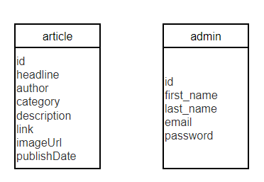

## Database Overview 

Name: anr 

Version: MySQL 8.0 

public ip address: 34.130.167.240

port: 3306

administrator: root

password: 12345678

## Database Architecture

- Tables: [article, admin]

Database Table Structures Table 1: [article]

- Description: In this table, the information of article will be stored in detailed.

- Columns: [id, headline, author, category, description, link, imageUrl, publishDate]

- | Column      | Type        | Default Value | Nullable | Extra                       |
  | ----------- | ----------- | ------------- | -------- | --------------------------- |
  | id          | int         |               | no       | primary key, auto increment |
  | headline    | varchar(45) |               | no       |                             |
  | author      | varchar(45) |               | yes      |                             |
  | category    | varchar(45) |               | no       |                             |
  | description | varchar(45) |               | no       |                             |
  | link        | varchar(45) |               | no       |                             |
  | imageUrl    | varchar(45) |               | no       |                             |
  | publishDate | varchar(45) |               | yes      |                             |

  

Table 2: [admin]

- Description: In this table, the information of administrator will be stored in detailed.

- Columns: [id, first_name, last_name, email, password]

- 

- | Column     | Type        | Default Value | Nullable | Extra                       |
  | ---------- | ----------- | ------------- | -------- | --------------------------- |
  | id         | int         |               | no       | primary key, auto increment |
  | first_name | varchar(45) |               | no       |                             |
  | last_name  | varchar(45) |               | yes      |                             |
  | email      | varchar(45) |               | no       |                             |
  | password   | varchar(45) |               | no       |                             |

## ER Diagram

The ER diagram of database is showing as below.

## Database Security

- Authentication and authorization

We have two steps to authorize. First we use passwords. Database can only be accessed by using correct password. Second we use IP address. We will record some IP in database setting, and only when people logging from those IP can access to database.

- Data backup and recovery

The database have data backups. Everyday the data will be backup automatically.The database has a total of seven different backups, and existing backups will only be overwritten when there are no more available backup locations. Backups can be kept in seven days so the database can be recovered from backups.

- Logs

The database has logs so that we can check past operations. 

